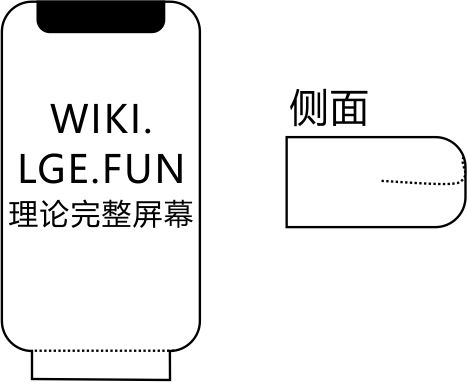

# 科普计划-显示器
  **CRT显示器（球面显像管显示器）**，对于这个显示器我想第一印象应该是笨重。不认识吗？十年前你还盯着她看直播的北京奥运会呢！对，就是那个体积超大的彩色电视。十年后的今天移动设备的显示器迎来了一次从**LCD（液态晶体显示器）** 到**OLED（有机发光二极管）** 的更新。 
## LCD
    我记得我小学二年级的时候，液晶电视这个词还是很新颖的，就像今天的OLED、QLED电视一样。液晶显示器的历史也比较久了，液晶显示器另外一种角度来说是一个纲，它的衍生产品实在太多了，可视角度加强又是一个名字换个排列方式又是一个名字。IPS-LCD为现在比较主流的LCD面板，可视角度比传统的TFT-LCD更大、没有水花纹、色域更广等优势成为了移动设备的首选。由于液晶不能直接发光，所以需要背光作为光源（背光材质有两种分别为LED\CCFL）。那么缺点来了，首先一下子亮完整个屏幕这是绝对耗电的，有些屏幕在显示黑色的时候还会漏光，应为结构限制不能做得很薄，转换角度会偏色等。对于CRT来说这都不是事，我更耗电更大。但是对于结构更小还有自发光属性的OLED来说嘛，LCD多多少少还是有点尴尬。 
## OLED
    LED灯我想大家都玩过吧，物理课出现的频率不少吧，认真听课的同学一定知道三基色原理吧！OLED可以理解为加强版的LED，OLED屏幕的每一个像素都是由红色的、蓝色的、绿色的加强LED灯组合起来的。如果是显示黑色三盏灯就不会亮起来，如果是红色那么蓝绿色就不用亮起来，这就是自发光属性。OLED的有点虽然不只有自发光属性，还有柔属性。还记得今年牛逼哄哄的IPhoneX吗？一般来说下巴会有控制的基板什么的，IX的屏幕没有下吧就是利用了柔性将屏幕做长一截就像折纸一样把多出来的一截折到下方再藏起来。还有速度等其他属性 

## 时间推移
    OLED会在移动设备里替代掉LCD是必然趋势，尽管LG做出拥有自发光属性的LCD，但是现在在移动领域里LCD是真的不擅长。既然OLED那么强为什么不像LCD一样全方面的替换CRT呢？寿命是关键，第二是价钱，谁也不想为了更好的体验花更多的钱买一个一次性的东西（当然不是一次性的），老化区域会偏色，真的老化的时候会烧屏。也许现在来看全方面替换是不现实的，但是现在谁还会抱着个CRT屏幕看电视什么的呢？
